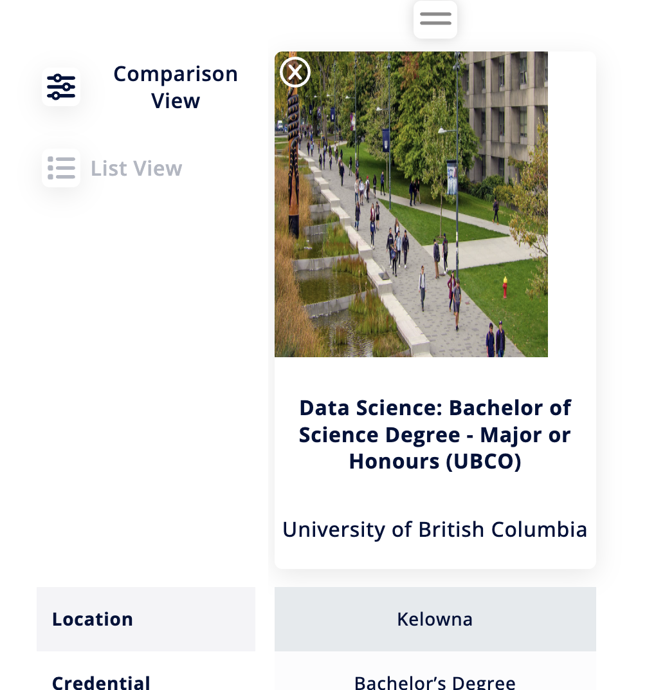

# epbc-assignment

Takehome technical assignment for EPBC. I wrote one parameterized test that tests the requested flow for both a desktop and mobile view.

## Requirements

Java version 21.0.1+

Apache Maven 3.9.10+

Selenium 4.34.0+

Google Chrome browser

## Instructions

Clone the repo and run

### `mvn clean install`

Then run

### `mvn test`

from the **/epbc-automation** directory to run the automated test.

## Bugs and Quality Observations

All testing done on Brave browser.

1. Insitution image not centered or scaled properly in My List Programs tab (Comparison View)

        The image for the institution is not centered in the draggable program card on the My List page when in comparison view. The scaling also stretches subjects in the image.

        Steps to Reproduce
            1. Sign in to an account.
            2. Add one or more programs to My List.
            3. Click the "Go to My List" button.
            4. Click "Explore my programs".
            5. Inspect the draggable program cards in the comparison view.

        Expected Results
            Image should be centered in the card and scaling should not be so noticeable/distorting.
        
        Actual results
            There is white space on the right side of the card. Image is noticeably distorted.
        
        Note: It seems there is a "right: 15%" offset applied to the images, removing this fixes the centering issue.

The following two are more so UX/observations than bugs.

2. Clearing search filters does not automatically refresh results.
    
        When search filters are cleared using the 'Clear' button, the results are not automatically refreshed.

        Steps to Reproduce
            1. Go to the search page and apply some filters.
            2. Press the 'Clear' button.

        Expected Result
            Search results should be immediately refreshed.
        
        Resulting Behavior
            Search results are not refreshed to clear the filtered results, user has to click the search button to refresh the results.

        UX note: Not sure if it's a bug, but applying filters does not automatically refresh the results either, user has to click search button to apply filters.

       
3. Search pagination appears when only one page of results is available

        When the number of search results are less than the set number of results per page, pagination appears despite there being only one page of results.

        Steps to Reproduce
            1. Go to the search page and apply some filters so the results are less than the set number of results per page (e.g. search UBC and apply Technology (IT) for Area of Study filter).
            2. Press Search and view results.

        Expected Result
            Pagination should not appear as there is only one page of results
        
        Actual Result
            Pagination appears (see right side of screenshot), if user clicks the "1", the viewport is scrolled up to the search bar.

## Test Cases for future testing

I consider these tests outside the scope of this assessment, but at a high level, here are some other tests cases to consider for this feature:

- Adding to list while not signed in
- Removal of program from my list from the search page
- Removal of program from comparison view
- Clicking apply now button opens appropriate page
- Clicking card in program list goes to institution page/program page
- Saved programs persist after logging out

## Limitations / Reflections

- This user account must not be used for other tests that add programs to the list or it will fail. Also will cause issues if test fails part way through this test!
    - I would address this by seeding data or using api before test to create a fresh user account. Can also add a check at the start of the test to ensure empty My List page.
- Adding too many programs might fail validation in the my list page because it requires horizontally scrolling.
- I had to use some brittle selectors relying on text content due to lack of id selectors
    - Tried to follow Selenium's recommended practice of using id  > cssSelector and only used XPath when I thought it would be more reliable (e.g. the filters have an id but seems they are assigned by an index, if order of filters is changed it would break the test if using the id as a locator)
- Use network response to validate login - out of scope, this should be done in a login suite.
    - Login validation should be done in a separate test.
- Might be better to break up list view and comparison view in My list into two separate pages and inherit from a generic my list page.
- I wanted to attempt integrating test runs on CI but didn't have time.        